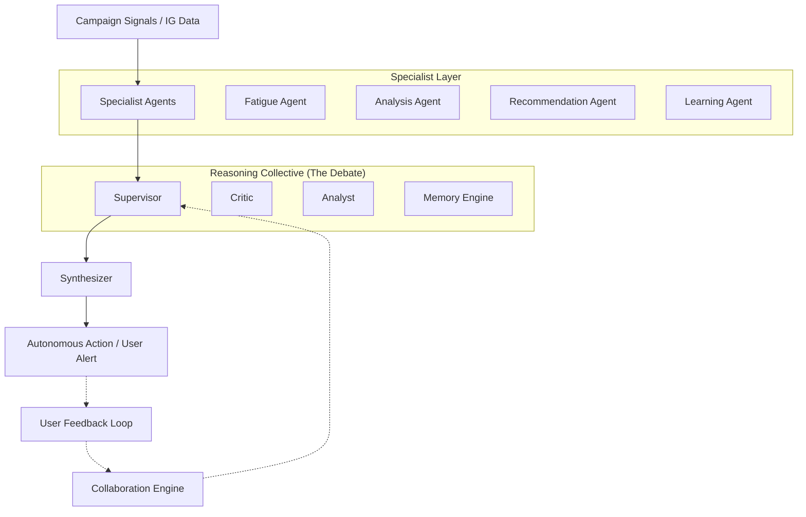

# AdBoostAI: Autonomous Ad Optimization Engine

[](https://nextjs.org/)
[](https://www.typescriptlang.org/)
[](https://tailwindcss.com/)
[](https://www.prisma.io/)

**The problem:** Marketers running paid ads lose 25–40% of their budget to fatigued creatives. CTR typically drops on day 3, but is often only noticed on day 8—by then, the budget is already wasted.

**The Solution:** AdBoostAI monitors campaign signals in real-time, orchestrates a structured AI debate between specialist agents, and either alerts the human or acts autonomously (pausing campaigns, capping spend, generating replacement copy) before the budget is drained.

---

## 🚀 Key Features

- **Real-time Signal Monitoring**: Continuous ingestion and analysis of campaign performance metrics.
- **Collaborative Agentic Reasoning**: A "Collective Intelligence" system featuring Analysts, Critics, Supervisors, and Synthesizers that debate the best course of action.
- **Behavioral Adaptation (Collaboration Engine)**: Learns from your decisions. If you frequently override certain suggestions, AdBoostAI adapts its risk tolerance and verbosity to match your management style.
- **Autonomous Intervention via n8n**: Seamlessly connects to automation workflows to pause underperforming ads or adjust budgets in real-time.
- **Generative Creative Engine**: Automatically generates fresh ad copy and creative directions when fatigue is detected.
- **Instagram Integration**: Built-in parser for rapid ingestion of creative assets and metadata directly from Instagram posts/reels.

---

## 🛠️ Tech Stack

- **Framework**: [Next.js 15+](https://nextjs.org/) (App Router, React 19)
- **Styling**: [Tailwind CSS 4.0](https://tailwindcss.com/)
- **Database**: [PostgreSQL](https://www.postgresql.org/) with [Prisma ORM](https://www.prisma.io/)
- **AI Orchestration**: Custom Agentic Reasoning Layer
- **Charts/Visualization**: [Chart.js](https://www.chartjs.org/) & [Recharts](https://recharts.org/)
- **Automation**: [n8n](https://n8n.io/) Webhooks

---

## 🧠 Agentic Architecture

AdBoostAI uses a dual-layered agent system to ensure decisions are robust and context-aware.



---

## 📸 Instagram Parser Technical Details

The project includes a robust Instagram ingestion utility (`lib/instagram-parser.ts`) that allows for quick data entry:

- **Endpoint**: Uses the Facebook Graph API oEmbed endpoint (`/instagram_oembed`).
- **Capabilities**:
  - Automatically detects URL types (Posts, Reels, TV, Accounts).
  - Extracts captions and performs hashtag analysis.
  - Retrieves high-quality thumbnails for creative previews.
  - **Fail-safe**: Includes a "Demo Fallback" mode that provides synthetic metadata and creative mocks when API limits are hit or tokens are missing.

---

## 🏁 Getting Started

### Prerequisites

- **Node.js**: 20.x or higher
- **Docker**: For running the PostgreSQL database
- **n8n** (Optional): For enabling autonomous campaign actions

### Installation

1. **Clone and Install**:
   ```bash
   git clone https://github.com/your-username/adboostai.git
   cd adboostai
   npm install
   ```

2. **Database Setup**:
   Start the provided PostgreSQL container:
   ```bash
   docker-compose up -d
   ```

3. **Environment Setup**:
   Copy the example environment file and update your credentials:
   ```bash
   cp .env.example .env
   ```

4. **Initialize Database**:
   ```bash
   npx prisma db push
   ```

5. **Run the Development Server**:
   ```bash
   npm run dev
   ```

---

## 📂 Project Structure

- `app/`: Next.js application routes and UI components.
- `core/agents/`: Domain-specific AI agents (Fatigue, Analysis, etc.).
- `core/reasoning/`: The collaboration and debate engine logic.
- `core/creative-engine.ts`: Generative logic for ad copy.
- `core/collaboration-engine.ts`: Behavioral adaptation logic.
- `lib/`: Utility libraries (Instagram parser, Prisma client).
- `prisma/`: Database schema definitions.

---
